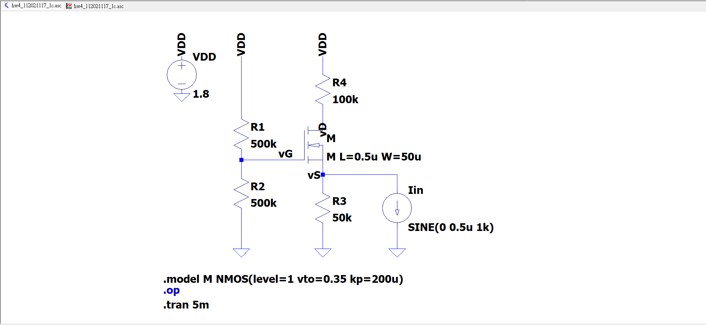
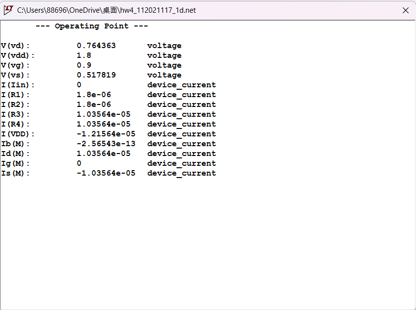
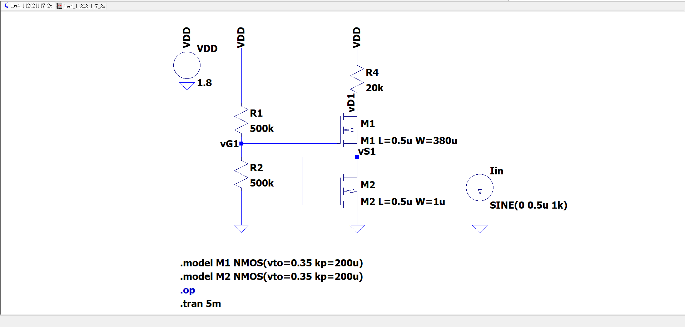
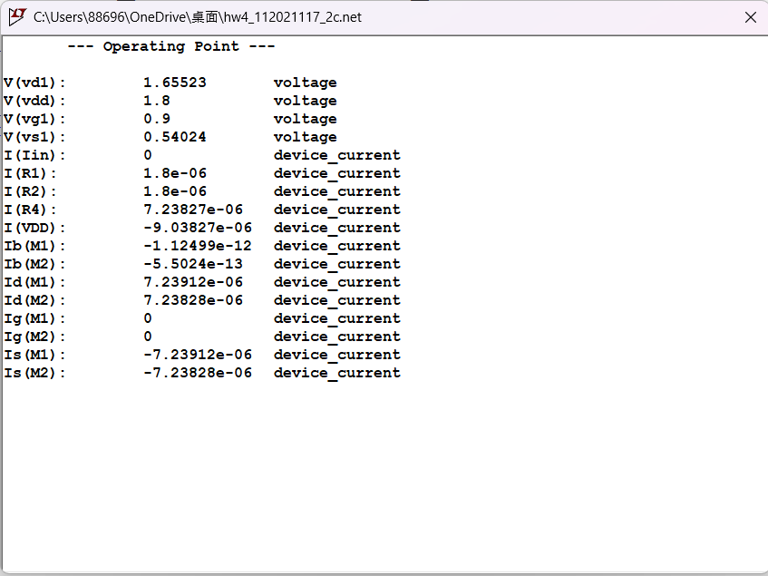

# Current Buffer Design (Common-Gate & Cascode) - README

本專案為共閘極電流緩衝器（Common-Gate Current Buffer）與疊接式電流緩衝器（Cascode Current Buffer）之設計與模擬整理，由 Chao-Yang Zhan 撰寫。內容包含理論推導、SPICE 電路圖、直流工作點與交流模擬驗證。

---

## 📋 系統設計規格 (Design Specifications)
* **電源電壓 (VDD)**：1.8 V
* **負載電阻 (R4)**：100 kΩ
* **製程與電晶體參數**：閾值電壓 Vth = 0.35 V，製程參數 kp = 200 μA/V2
* **設計目標**：電流增益 > 0.95 A/A，總功率消耗 < 0.6 mW

---

## 1. 共閘極放大器設計 (Common-Gate Amplifier)
* **偏壓與功率設計**：選定汲極電流 ID = 9 μA、偏置網路電流 Ibias ≈ 1.8 μA，總電流 Itotal = 10.8 μA，總功率消耗 Ptotal = 19.44 μW，遠低於 0.6 mW 上限。
* **元件尺寸與偏壓**：源極電阻 R3 = 50 kΩ 使 VS = 0.45 V。電晶體 M1 尺寸設定為 W = 50 μm、L = 0.5 μm。分壓電阻 R1 = 500 kΩ、R2 = 500 kΩ 提供 VG = 0.9 V。
* **模擬驗證**：實際 DC 工作點模擬顯示總電流 Itotal = 12.16 μA，總功率 Ptotal ≈ 21.88 μW。電流增益 Ai ≈ 0.962 A/A，成功達成 > 0.95 之規範。

| 電路原理圖與配置 | DC 工作點與暫態響應 |
| :---: | :---: |
|  *圖 1：共閘極放大器 SPICE 電路圖* |  *圖 2：DC 工作點與電流增益輸出波形* |

---

## 2. 疊接式電流緩衝器設計 (Cascode Current Buffer)
* **偏壓與功率設計**：選定汲極電流 ID = 20 μA、偏置電流 Ibias ≈ 2 μA，總電流 Itotal = 22 μA，總功率消耗 Ptotal = 39.6 μW。
* **元件尺寸與偏壓**：採用 R1 = R2 = 500 kΩ 設定 VG = 0.9 V。M2 採二極體連接，尺寸 W2 = 1 μm、L = 0.5 μm。M1 尺寸設定為 W1 = 380 μm、L = 0.5 μm。負載電阻 R4 = 20 kΩ。
* **模擬驗證**：實際總電流 9.04 μA，總功率 Ptotal ≈ 16.27 μW。測得電流增益 Ai ≈ 0.952 A/A，滿足設計需求。

| 疊接式電路原理圖 | 工作點與電流增益波形 |
| :---: | :---: |
|  *圖 3：Cascode 電流緩衝器電路圖* |  *圖 4：Cascode 體系之 DC 工作點與波形* |

---

## 3. 架構效能比較與總結
* **效能對比**：
  * **共閘極 (CG)**：電流增益 0.962，輸入阻抗約為 1/gm1，設計靈活性較低。
  * **疊接式 (Cascode)**：電流增益 0.952，輸入阻抗約為 1/gm1 ∥ 1/gm2，具備高設計靈活性與確定性增益控制。
* **主要優勢**：
  * **精確增益控制**：透過寬長比設定可精確調控跨導比例，使電流轉移率高度可預測。
  * **設計效率高**：偏置需求與緩衝效能解耦，使設計迭代更加簡便。
  * **高強健性**：提供優異的輸出阻抗與穩定的 M1 直流操作點。